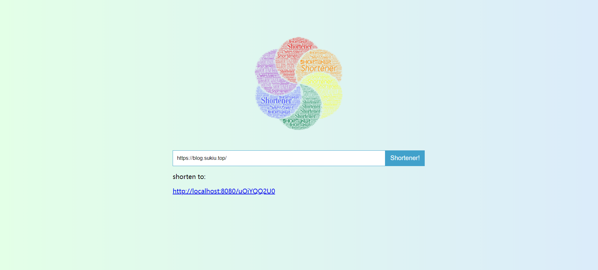

# Shortener

`Shortener` is a service to shorten long URLs to generated short URLs and handle the redirection.

> Study work, not yet perfect

## Screenshots

<table>
<tr>
<td></td>
<td></td>
</tr>
</table>

## Config

**config/config.json**

```json
{
  "server": {
    "host": "127.0.0.1",
    "port": ":8080"
  },
  "redis": {
    "addr": "localhost:6379",
    "password": "",
    "db": 0
  },
  "exp": 30
}
```

## Usage

```go
package main

import "github.com/SukiEva/shortener"

func main() {
	if s, err := shortener.New(); err == nil {
		s.Serve()
	}
}
```

## API

See it [here](docs/API.md)

## Credits

- [Gin](https://github.com/gin-gonic/gin): A HTTP web framework written in Go (Golang)
- [Go-redis](https://github.com/go-redis/redis): Type-safe Redis client for Golang
- [Token](https://github.com/marksalpeter/token/): A simple base62 encoded token library for go, ideal for short url services
